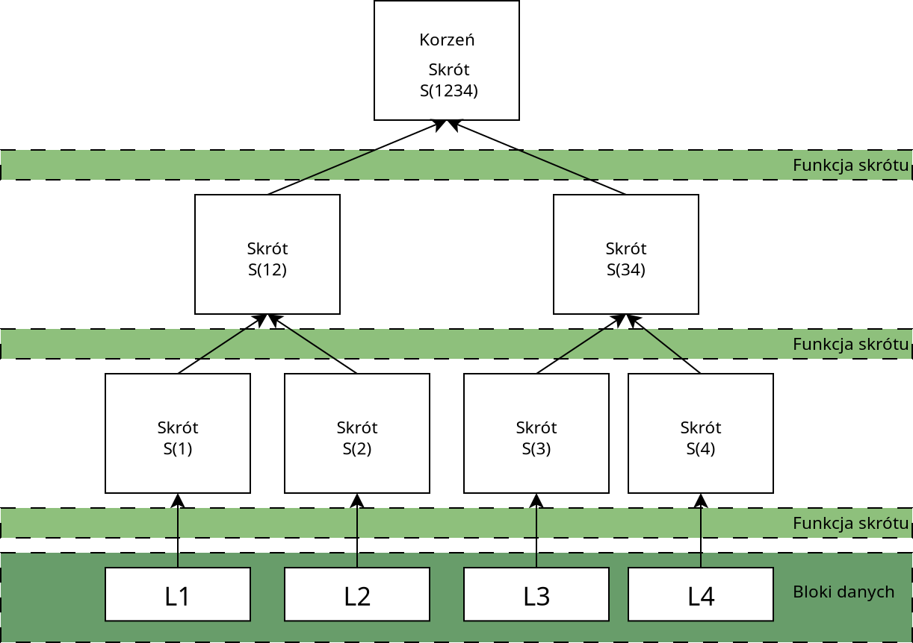
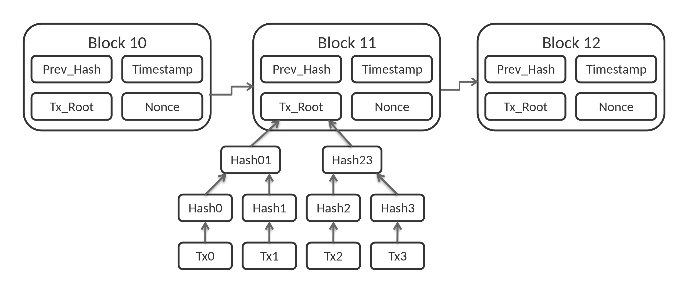
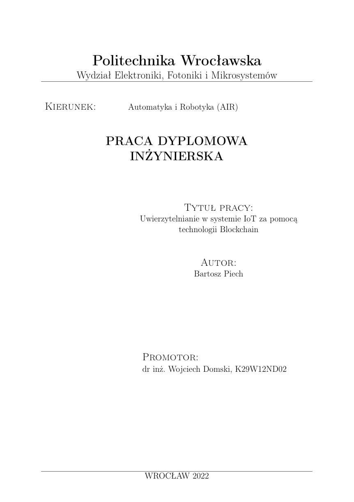
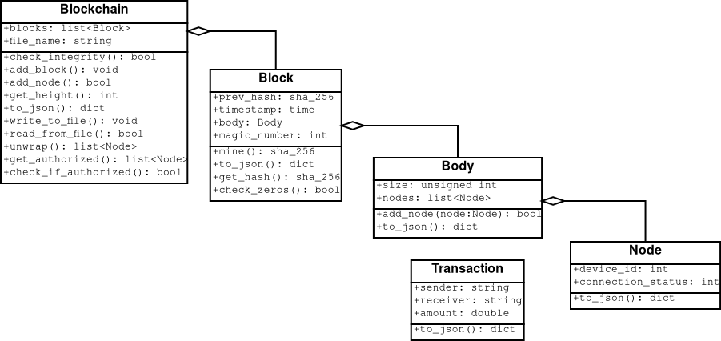

# Agenda
- Wprowadzenie
	- czym jest technologia łańcucha bloków?
	- wprowadzenie do Internetu Rzeczy,
	- moje doświadczenia,
- Część główna
	- własności Blockchainu,
	- zastosowania w kontekście systemów IoT,
	- zalety i wady,
	- jak napisać własny blockchain?
	- testy własnego łańcucha bloków,
- Zakończenie
	- podsumowanie,
	- bibliografia

# Czym jest technologia łańcucha bloków?
## Historia Blockchainu
- pierwszą propozycję opracowania protokołu podobnego do Blockchainu zaproponował David Chaum w pracy doktorskiej z 1982r.
- wywodzi się od drzewa skrótu (z ang. *Merkle Tree*)
- Blockchain zyskał popularność około 2008r. gdy został użyty jako główny komponent pierwszej kryptowaluty -- Bitcoina

# Czym jest technologia łańcucha bloków?

# Czym jest technologia łańcucha bloków?
## Definicja
Łańcuch bloków połączonych ze sobą przy pomocy kryptograficznych funkcji skrótu.
Rozproszona baza danych przechowywana na wielu urządzeniach jednocześnie

# Czym jest technologia łańcucha bloków?
Blockchain składa się z jednokierunkowej listy bloków, które dzielą się na nagłówek oraz ciało. Nagłówek przetrzymuje metadane na temat swojego poprzednika. Ciało stanowią dane, które ma przechowywać łańcuch.

# Algorytm konsensusu
Istnieje wiele typów algorytmów opartych na dowodzie. Są to między innymi:

- ,,Proof of Work'' – dowód wykonanej pracy,
- ,,Proof of Stake'' – dowód posiadanych zasobów,
- ,,Delegated Proof of Stake'' – delegowany dowód posiadanych zasobów,
- ,,Proof of Authority'' – dowód posiadanego autorytetu,
- ,,Proof of Capacity'' – dowód oparty o dostępność zasobów,
- ,,Proof of Activity'' – dowód aktywności,
- ,,Proof of Burn'' – dowód wypalenie,
- ,,Proof of Weight'' – dowód ważonego udziału w posiadanych zasobach.

# numer ,,Magiczny''
Inaczej *Nonce*, w metodzie ,,Proof of work'' należy odnaleźć taki *Nonce*, aby funkcja haszująca (SHA256) zwróciła ciąg znaków zawierający pierwsze n znaków będących zerami, im więcej zer, tym trudniej znaleźć odpowiedni numer ,,magiczny''
(ilość zer na początku skrótu bloku Bitcoin wynosi ~19)

# Wprowadzenie do Internetu Rzeczy
Internet Rzeczy tworzą najczęściej urządzenia o niewielkiej mocy obliczeniowej, posiadają one wbudowane czujniki pozwalające na zbieranie oraz przetwarzanie danych pochodzących z otoczenia. Technologia Internetu Rzeczy wykorzystywana jest podczas tworzenia inteligentnych budynków. Pozwala ona na kontrolowanie temperatury w pomieszczeniach, systemów zabezpieczeń, sprzętów gospodarstwa domowego takich jak pralki, lodówki, telewizory, bądź oświetlenie, odczyt i przesył pomiarów z czujników.

# Moje doświadczenia

# Własności Blockchainu
Zalety:

- poprawnie stworzony zapewnia integralność systemu,
- umożliwia dostęp do przechowywanych danych każdemu urządzeniu podłączonemu do sieci,
- w łatwy sposób umożliwia ukrycie danych użytkowników korzystających z systemu, np. z pomocą kluczy asymetrycznych,
- nie podatny na ataki Sybil przy poprawnym doborze algorytmu konsensusu.
- odporność na ataki man-in-the-middle oraz DoS (z ang. *Denial of service*)
- zwiększona anonimowość,

# Własności Blockchainu
Wady:

- problemy ze skalowalnością systemu,
- dane mogą być odczytywane przez każdego,
- zależnie od wybranego algorytmu konsensusu duży pobór zasobów obliczeniowych = energii = duże koszta.

# Zastosowania w kontekście systemów IoT
Połączenie tych technologii jest przydatne przy uwierzytelnianiu i przetwarzaniu dużej ilości danych pochodzących z wielu źródeł, które następnie mogą być składowane w rozproszonych bazach danych -- łańcuchach bloków

# Zastosowania w kontekście systemów IoT
Urządzenia IoT zbierające dane od:

- Dostawcy i przedsiębiorstwa:
	- paragony / faktury,
	- numery partii,
	- daty wysłek,
	- kody kreskowe.

- Dystrybucja, logistyka:
	- data wysyłki,
	- numer zamówienia,
	- numer przesyłki,
	- numer seryjny produktu,
	- temperatura produktu,
	- data otrzymania przesyłki,
	- kody kreskowe.

- Sklepy:
	- Specyfikacja produktu, alergeny, skład, makroskładniki,
	- kody kreskowe,
	- świeżość produktów (mięs, warzyw i owoców).

# Jak napisać własny blockchain?
- Python
	- flask,
	- ZeroMQ,
- Docker

# Testy własnego łańcucha bloków
- Sprawdzenie integralności łańcucha: 11.8 us/block,
- dodawanie / usuwanie węzłów: 4.5 node/s
- prędkość komunikacji pomiędzy urządzeniami IoT w sieci: 3.6kB/s

# Podsumowanie
- Blockchain umożliwia stworzenie rozproszonej bazy danych zapewniając integralność przechowywanych danych i szeroki dostęp do nich użytkownikom w całej sieci.
- Zastosowań w kontekście systemów IoT jest wiele, jednakże ciężko znaleźć gotowe rozwiązania,
- Zastosowanie systemów wykorzystujących blockchain zwiększa bezpieczeństwo ale powoduje gorsze prędkości komunikacji.

# Bibliografia
- [1] K. Ashton. That ’internet of things’ thing, Jun 2009.
- [2] I. Bashir. Mastering blockchain: A deep dive into distributed ledgers, consensus protocols, Smart Contracts, Dapps,cryptocurrencies, Ethereum, and more. Packt Publishing, 2020.
- [3] Bitcoin Magazine.What is the Bitcoin block size limit?, Aug 2020.https://bitcoinmagazine.com/guides/what-is-the-bitcoin-block-size-limit.
- [4] D. L. Chaum. Computer Systems Established, Maintained, and Trusted by Mutually Suspicious Groups. University ofCalifornia, Berkeley, 1982. Praca doktorska.
- [5] D. Drescher, L. Sielicki. Blockchain: Podstawy Technologii łańcucha bloków w 25 Krokach. Helion, 2021.
- [6] R. Haider. Web API Development With Python, A Beginner’s Guide using Flask and FastAPI. CloudBytes, 2021.

# Bibliografia
- [7] P. Hintjens. ZeroMQ: Messaging for many applications. O’Reilly Media, 2013.
- [8] R. Mardisalu.Introduction to cryptography: Simple guide for beginners, Oct 2020.https://thebestvpn.com/cryptography/.
- [9] R. Marvin.Blockchain: The invisible technology that’s changing the world, Aug 2017.https://au.pcmag.com/enterprise/46389/blockchain-the-invisible-technology-thats-changing-the-world.
- [10] A. Rot. Zastosowanie technologii Blockchain w kontekście bezpieczeństwa rozwiązań Internetu rzeczy, strony 57–71.Wydawnictwo Politechniki Częstochowskiej, 2018.
- [11] M. Swan, M. Lipa. Blockchain: Fundament nowej gospodarki. Helion SA, 2020.
- [12] D. Tomaszewski. Protokoły komunikacyjne wykorzystywane w systemach IoT, Feb 2020. https://elektronikab2b.

# Dziękuję bardzo za uwagę

